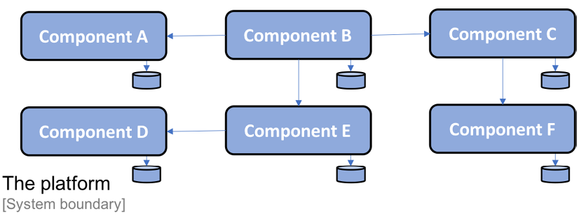

## Introduction to Microservices

Main aim is to build scalable, resilient and managaeable microservices.

Look at C4 model https://c4model.com - it is a software architecture diagramming guide.

The microservices architecture uses **autonomous software component** -> having own persistent data and only communicated with other components using well defined APIs

We can see that each component has its own storage for persistent data and is not sharing DB with other components

### Benefits of autonomous software components
1. Customer can deploy parts of the platform in its own system landscape.
2. Another customer can choose to replace parts of the platforms functionality with implementations that already exist in the customer system landscape, potentially requiring some adoption of the existing functionality in the platforms API.
3. Each component in the platform can be delivered and upgraded separately. Thanks to the use of well defined API. One component can be upgraded to a new version without being dependent on the life cycle of the other components.
4. Due to well defined APIs, each component in the platform can also be scaled out to multiple servers independently of the other components. Scaling can be done better to meet high availability requirements or to handle higher volumes of requests. It can be achieved by manually setting up load balancers in front of a number of servers each running in Java web container.

### Challenges with autonomous software components
1. Adding new instances -> required manually configuring load balancers and many setting up new nodes.
2. Communication ->  If a system stopped responding to request that was sent from the platform in a timely fashion, the platform quickly ran out of crucial resources. e.g., OS threads specifically exposed to large number of concurrent requests. ->  hang or even crash.  Synchronous communication can lead to cascading failures -> chain of failures.
3. Keeping the configuration in all the instances of the components consistent and up to date.
4. Monitoring the state of the platform in terms of latency issues in hardware usage. For example, you CPU, memory, disks and the network.
5. Collecting log files from number of distributed components and correlating related log events from the components.

### Enter microservices
Some important terminologies
1. Vertical scaling (And more resources like CPU, RAM etc.)
2. Horizontal scaling. (Deploying a component on a number of smaller servers and placing load balance in front of it.If done in the cloud,the scaling capability is potentially endless. It is just a matter of how many virtual servers you can bring in.)

Some open source projects that delivered tools and frameworks that prefer the developer of Microsoft Office and could be used to handle the challenges that come with micro services are as follows:
1. Spring Cloud, which wraps parts of Netflix OSS in order to provide capabilities such as Dynamic Service Discovery, configuration management, distributed tracing, circuit breaking and more.
2. Docker.Is great for minimising the gap between development and production.Packaging a component not only as deployable runtime artifact but as complete image ready to be launched as a container on a server running Docker.
3. A container engine is not enough to be able to use containers in a production environment.Some things needed that can ensure that all the containers are up and running and can scale out the containers on the number of servers  providing high availability and increased computer resources.These type of product, known as container orchestrators.like Kubernetes, Apache Mesos, Mazon ECS, Hshicorp Nomad.
4. Service mesh - Complementary Container office Twitter. To further offload microservices from responsibilities to make them manageable and resilient.
